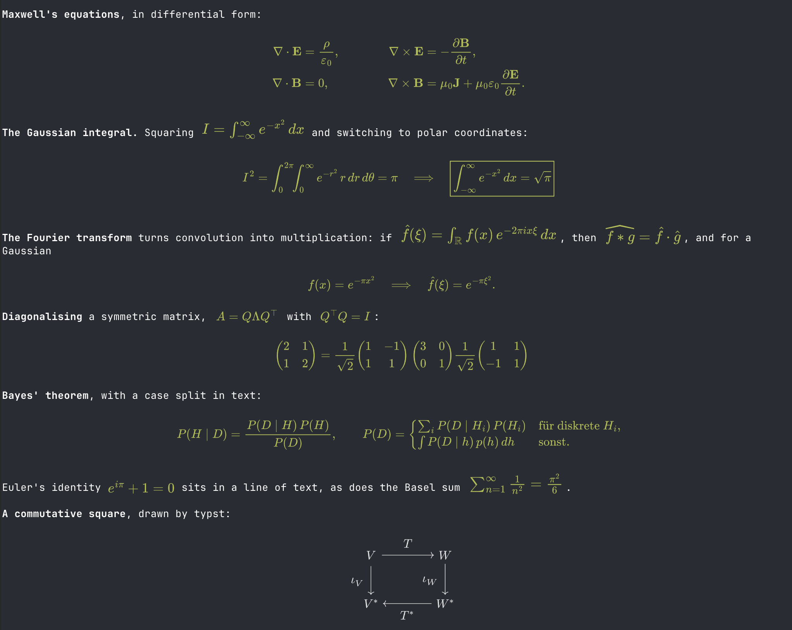

# texel

## Built by Claude, for Claude.

Typeset math in Claude Code's terminal. texel is a Claude Code plugin that
redraws Claude's replies, and your own prompts, with LaTeX math and typst
blocks rendered as images, inline with the text around them. Inspired by
[pi-math](https://github.com/Fadouse/pi-math).



- **LaTeX, with nothing to install.** `\( … \)`, `\[ … \]`, `$ … $`,
  `$$ … $$` and ```` ```math ```` fences are typeset by MathJax, which runs
  inside the plugin. ```` ```latex ```` and ```` ```tex ```` fences stay code,
  as LaTeX source to read or copy.
- **Inline math sits in the line.** Formulas sit on the text's baseline at a
  readable size; a tall one (a fraction, a matrix) gives its line the extra
  rows it needs, as LaTeX does, and the paragraph re-wraps around it.
- **typst blocks**, if typst is installed: a ```` ```typst ```` fence is set by
  typst, as a figure (cetz diagrams, tables) or as prose laid out at the
  terminal's width.
- **Claude knows.** A short note in the system prompt tells Claude this
  terminal typesets LaTeX, and typst blocks where typst can draw them.

## Requirements

- **Claude Code 2.1.292 or newer**, with plugin hooks (mods). They are early
  access, so texel may need updating as Claude Code changes.
- **A terminal that shows Claude Code's images**: kitty, Ghostty, or cmux
  (Ghostty-based). Not through tmux. Elsewhere texel steps aside and Claude
  Code's own rendering stays.
- **Optional: typst 0.15 or newer**, for ```` ```typst ```` blocks
  (`brew install typst`). Without it, LaTeX still renders; a typst block shows
  its source and says what it needs.

## Install

In Claude Code:

```
/plugin install texel --marketplace arki05/texel
```

Answer `y` to add the marketplace, then choose a scope. texel is active at once.
From a shell: `claude plugin install texel --marketplace arki05/texel`.

## Use

Ask Claude for anything with math in it; it writes LaTeX, and texel draws it.
Your own prompts are rendered too.

| Command | What it does |
|---|---|
| `/texel` | What texel draws with here: pictures on or off, typst found or not. |
| `/texel source` | Shows every message as its source, for reading or copying, until you run it again. Selecting a rendered formula copies placeholder characters, not its LaTeX. |

**Your own macros.** `~/.config/texel/macros.tex` is read before every
formula, so `\newcommand`s there work everywhere; Claude never sees the file.

```latex
\newcommand{\norm}[1]{\left\lVert #1 \right\rVert}
\newcommand{\inner}[2]{\left\langle #1, #2 \right\rangle}
```

## Settings

All in `/config`, under texel.

| Setting | Default | |
|---|---|---|
| `promptNote` | on | Tell Claude this terminal typesets math. |
| `mathColor` | `#b3bd5a` | Colour of LaTeX math; empty follows the text colour. |
| `typstColor` | empty | Colour of typst blocks' text; empty follows the text colour. |
| `typstPackages` | on | Let typst blocks import packages (typst downloads them). Off: such a block shows its source. |
| `inlineSize` | 1.2 | Inline math's size against the text's x-height. |
| `inlineMinScale` | 0.75 | How far a formula may shrink before its line gains a row. |
| `inlineMaxScale` | 1 | How far a formula smaller than its row may grow to fill it. |
| `inlineShiftUp`, `inlineShiftDown` | 0.5 | How far (in rows) a formula may sit off the baseline to save a row. |
| `terminalFont` | JetBrains Mono | Your terminal's font, so math matches its proportions: JetBrains Mono (Ghostty's default), Menlo / DejaVu Sans Mono (kitty's), SF Mono, Monaco, or Custom with `fontAspect`, `fontXHeight` and `fontBaseline`. |
| `images` | auto | Draw pictures: `auto` (in kitty and Ghostty, not tmux), `always`, `never`. |

## Limitations

- **One colour per formula.** `\color` and `\colorbox` are read, but a
  formula is drawn in the math colour; a `\colorbox` shows its contents
  without the box's background.
- **Rendered math cannot be copied.** Selecting it copies placeholder
  characters; `/texel source` shows the LaTeX.
- **Characters MathJax's fonts lack.** In `\text{…}`, accented Latin letters
  (ä, é, ñ, š, …) are drawn; ß, æ, ø, å, ç, Greek, Cyrillic and CJK are not,
  and a formula using them shows its source and names the character.
- **TeX packages:** base, AMS, newcommand, boldsymbol, braket, mathtools,
  cancel, color and textmacros. An unknown command is an error, as in LaTeX.
- **No equation numbers.** `\tag` and numbered environments show their
  source.
- **Not through tmux**, which does not pass the pictures through.
- **Very wide inline formulas** (ones that would have to shrink below half
  size to fit the line) show their source.

## How it works

texel hooks Claude Code's rendering of transcript rows. A reply's markdown is
split into prose, inline math, display math and typst blocks.

- **LaTeX** goes to MathJax, bundled into the plugin, whose SVG texel fills
  into pixels itself: a plugin has no canvas and no WebAssembly. MathJax's
  SVG is read as outlines (strokes, clipping and its stylesheet's table
  rules included; anything else is refused, not guessed at), and a small
  rasteriser fills them by exact area coverage, the technique of font-rs and
  tiny-skia; the pixels go to the terminal as a PNG (compressed by the
  bundled fflate). Development checks the drawing against resvg over a
  corpus of formulas.
- **typst blocks** go to the `typst` command line, a few at a time, and are
  cached by content in your cache folder (`~/Library/Caches/texel`, or
  `$XDG_CACHE_HOME/texel`).
- **Inline formulas** are measured, then fitted into their line in whole
  terminal rows; texel wraps those paragraphs itself so every row lines up.
- **Nothing waits.** A picture not ready yet shows its source and is drawn
  when it is, so a resize or a long reply never holds up the transcript.

## Develop

```sh
npm install                   # build tooling: MathJax, fflate, esbuild, TypeScript, resvg (dev only)
npm test                      # the plugin's tests (claude plugin test plugin)
npm run typecheck             # after one `claude --plugin-dir plugin` session, which writes the types Claude Code gives a plugin
npm run smoke                 # both backends for real; the drawing against resvg
npm run build:vendor          # rebuild the bundled MathJax and fflate (the plugin's vendor folders)
npm run check:vendor          # the same, failing if the committed bundle differs
claude plugin validate .      # marketplace, manifest and hooks
claude --plugin-dir plugin    # a session with this checkout's texel, reloaded on edit
```

## License

MIT, see [LICENSE](LICENSE). The bundled MathJax is Apache-2.0 and the
bundled fflate MIT, each with its licence and provenance in its vendor folder
(`plugin/hooks/render/mathjax/vendor/`, `plugin/hooks/render/vendor/`).
